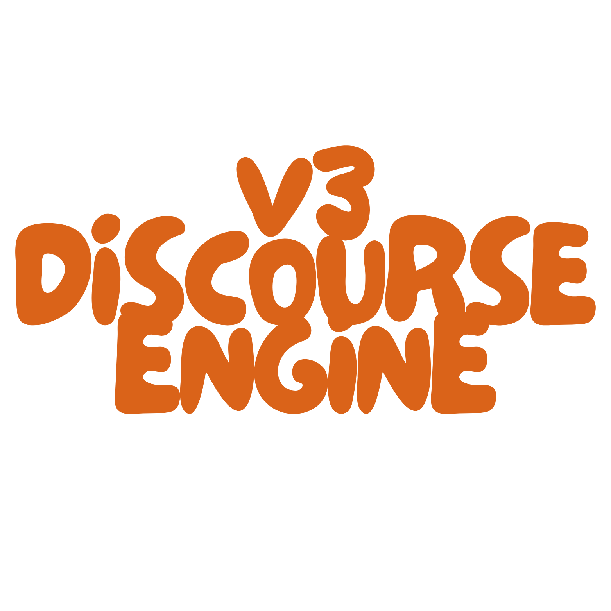
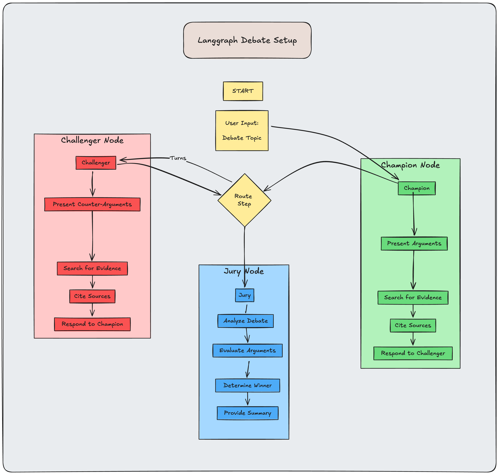

# V3 Discourse Engine 🤖

<div align="center">
  
  <p><em>An AI-powered debate platform for exploring multiple perspectives</em></p>
</div>

## Overview 🌟

V3 Discourse Engine is a sophisticated multi-agent AI system that facilitates structured debates on any topic. Using LangGraph for orchestration and GPT-4 for reasoning, the platform enables evidence-based discussions with real-time web research capabilities.

<div align="center">
  
</div>

## Features ✨

- 🎯 **Dynamic Multi-Agent Debates**
  - Champion agent supporting the topic
  - Challenger agent providing counterarguments
  - Jury agent analyzing and determining winners

- 🔍 **Real-Time Research**
  - Live Google Search integration
  - Evidence-based arguments
  - Source citations

- 🎭 **Structured Debate Format**
  - Opening arguments
  - Rebuttals and counterarguments
  - Closing statements

- ⚖️ **Comprehensive Analysis**
  - Argument strength evaluation
  - Evidence assessment
  - Detailed verdict with reasoning

## Technical Architecture 🏗️

<div align="center">
  
</div>

### Multi-Agent Orchestration
- Built on LangGraph's StateGraph system
- Implements sophisticated agent handoffs
- Manages debate state and turn progression

### Components
- **Champion Node**: Presents primary arguments supporting the topic
- **Challenger Node**: Provides counter-arguments and alternative perspectives
- **Jury Node**: Analyzes the debate and determines the outcome

## Getting Started 🚀

### Prerequisites
- Python 3.8+
- OpenAI API key
- Google Search API credentials

### Installation

1. Clone the repository:
```bash
git clone https://github.com/yourusername/v3-discourse-engine.git
cd v3-discourse-engine
```

2. Install dependencies:
```bash
pip install -r requirements.txt
```

3. Set up environment variables:
```bash
cp .env.example .env
```
Edit `.env` with your API keys:
```
OPENAI_API_KEY=your_openai_key
GOOGLE_API_KEY=your_google_key
GOOGLE_CSE_ID=your_search_engine_id
```

4. Run the application:
```bash
streamlit run Welcome.py
```

## Usage 📝

1. Configure your OpenAI API key in the welcome page
2. Navigate to "Try out a debate!"
3. Choose from preset topics or enter your own
4. Watch as AI agents debate with real-time research
5. Review the jury's analysis and verdict

## Example Topics 💭

- Technology and AI ethics
- Scientific theories and methodologies
- Social and political issues
- Business strategies and decisions
- Educational approaches
- Environmental policies

## Development 🛠️

### Project Structure
```
v3-discourse-engine/
├── Welcome.py              # Main entry point
├── pages/
│   ├── about.py           # About page
│   ├── Multi-Agent_Orchestration.py  # Architecture explanation
│   └── 3_Try_out_a_debate!.py       # Debate interface
├── assets/                # Images and animations
└── requirements.txt       # Dependencies
```

### Key Dependencies
- `streamlit`: Web interface
- `langgraph`: Multi-agent orchestration
- `langchain`: LLM integration
- `google-api-python-client`: Search functionality

## About the Creator 👨‍💻

**William VanSickle III**
- Founder, V3 AI
- Product Manager @ Justworks
- Based in Brooklyn, NY

### Connect
[](https://github.com/williavs)
[](https://www.linkedin.com/in/willyv3/)
[](https://v3-ai.com)

## License 📄

This project is licensed under the MIT License - see the [LICENSE](LICENSE) file for details.

## Acknowledgments 🙏

- Built with [LangGraph](https://github.com/langchain-ai/langgraph)
- Powered by OpenAI's GPT-4
- Streamlit for the beautiful UI

---

<div align="center">
  <p>© 2024 V3 AI | Created by William VanSickle III</p>
  <p><a href="https://v3-ai.com">Visit V3 AI →</a></p>
</div> 